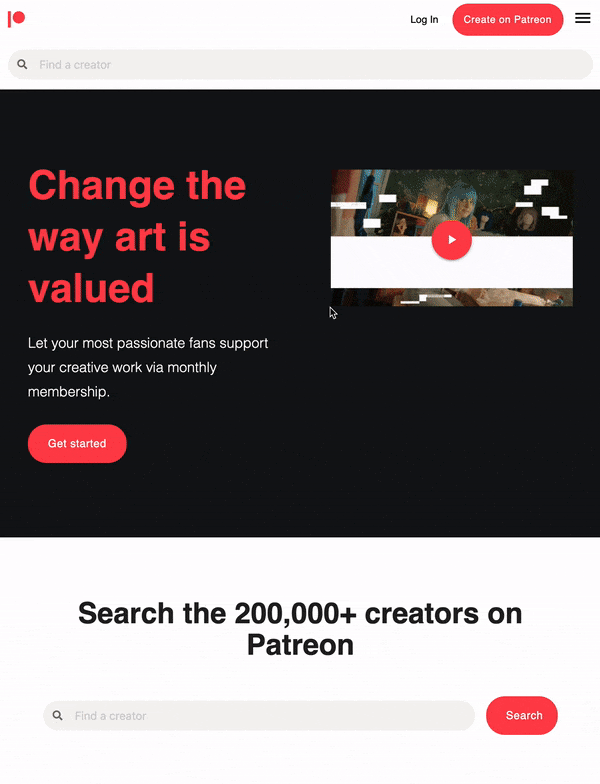

# PATREON-clone

## Description

Assignment from HackYourFuture curriculum that recreates the UI of [Patreon website](https://www.patreon.com/) using [Materialize CSS](https://materializecss.com/).

[Demo](https://danijelcvit.github.io/PATREON-clone/)

